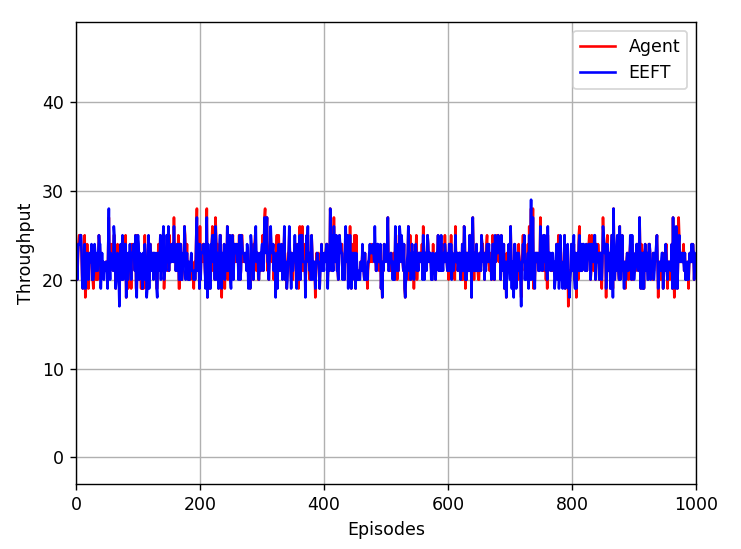
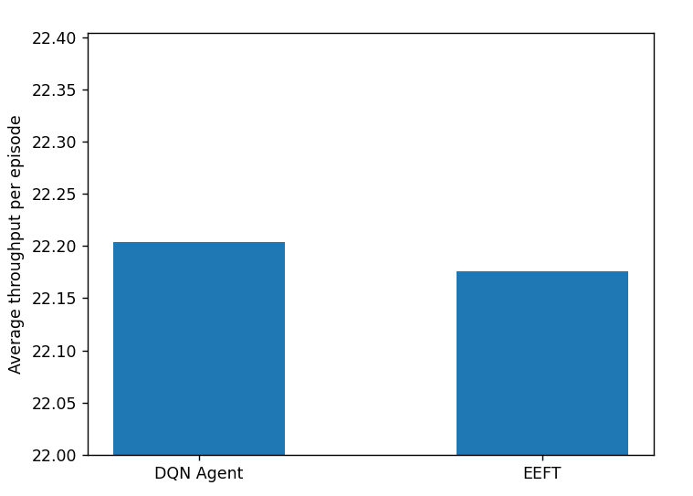

# Cloud Scheduling 

## Table of Contents
- [Overview](#Overview)
- [Installation](#Installation)
- [Model](#Model)
- [Data Preparation](#Data-Preparation)
- [Evaluation](#Evaluation)
- [Running with Docker](#Running-with-Docker)


## Overview
This project is inspired by a common real-world scenario in which a store employee is responsible for directing customers to checkout lines after shopping. Each customer carries a shopping cart with a varying number of items, and the employee must decide which checkout counter they should join to minimize overall waiting time and improve service efficiency.

In this analogy:
- The store employee functions as the **agent**.
- Each customer corresponds to a **job**.
- The number of items in the cart represents the **estimated workload** of that job.
- Each checkout counter is modeled as a **server queue**.
- Importantly, the agent has access only to **noisy workload estimates** rather than the actual service time.

In practice, humans often rely on simple heuristics—such as assigning customers to the queue with the lowest estimated workload. This project investigates how a **Deep Reinforcement Learning (RL)** agent can learn a more effective job dispatching policy, potentially outperforming such intuitive strategies in uncertain environments.


## Model 
- Apply Double DQN to stablize and reduce Q-value overestimation during learning. 
- The model is trained implementing Stable-Baselines3.
- Action space: selects server's number, defers.


## Data Preparation
- The environment generates job data based on Gaussian (normal) distributions to simulate real-world uncertainty in workload estimation.

- When creating a new job, the **estimated workload** is first sampled from a Gaussian distribution, where the random variable is the estimated workload itself. This value serves as an approximation of the actual job size and is passed to initialize a job object. (**estimated-workload ~ N(mean=25, std=8.0)**)

- The **actual workload**, which is unknown to the agent, is then sampled from another Gaussian distribution centered around the estimated workload. In this case, the estimated workload acts as the **mean**, and a predefined standard deviation controls the noise level. This models real-world scenarios where estimation errors occur due to incomplete or noisy information. (**actual-workload ~ N(mean=estimated-workload, std=5.0)**)

- Both estimated and actual workloads are clipped to remain within realistic bounds, ensuring job feasibility.


## Installation
To install your new environment, run the following commands:

```shell
cd job-simulator-env
pip install -e .
```


To install your dependencies:

```shell
pip install -r requirements.txt
```


## Evaluation

- To assess the performance of the trained RL agent, we compare its **throughput** defined as the number of jobs completed per episode against a strong heuristic baseline: the **Estimated Earliest Finish Time (EEFT)** policy.

- Both the RL agent and the EEFT policy are evaluated on **identical job arrival sequences**. This is achieved by synchronizing the random seed during environment reset, ensuring a fair and consistent comparison.

- For each test episode:
  - The EEFT policy selects a server based on the estimated finish time of each queue and dispatches jobs accordingly. *(simulates human's behaviour)*
  - The RL agent predicts its actions using the trained `best_model` checkpoint.
  - Throughput (i.e., total completed jobs) is recorded for both algorithms.

- The evaluation loop runs for a fixed number of test episodes (e.g., 10000). After each episode, the throughput of both methods is:
  - Printed to the terminal for immediate visibility.
  - Plotted in real time using `matplotlib` to visualize performance trends across episodes.

- At the end of evaluation, the average throughput is computed and reported for both algorithms. The algorithm with higher average throughput is declared the winner.

This comparative setup enables a quantitative and visual analysis of how well the RL agent generalizes beyond its training episodes and whether it outperforms or underperforms compared to a hand-crafted heuristic.

- Result:






##  Running with Docker
This image provides an environment to run training and evaluation scripts:
Pull this image: 
```bash
docker pull ghcr.io/johnnyau19/cloud-scheduling:v1
```
Execute:
```bash
docker run --rm -it ghcr.io/johnnyau19/cloud-scheduling:v1
```
Inside the container:
- To evaluate the model and compare with EEFT policy, run:
```bash
python3 ./evaluate.py
```

- To see latency comparison, please run:
```bash
python3 ./benchmark_runtime.py
```

- To train the model: 
```bash
python3 ./train.py
```

This image containerizes the FastAPI server for exposing the scheduling service via HTTP. 
To pull the image:
```bash
docker pull ghcr.io/johnnyau19/cloud-scheduling:v2
```

Execute:
```bash
docker run --rm -p 8080:8000 -it ghcr.io/johnnyau19/cloud-scheduling:v2
```

Access the API: `http://127.0.0.1:8080/docs`


